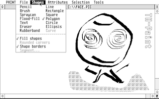
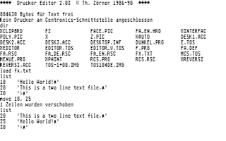

# Assembly programs for Atari-ST

These are two assembly programs I wrote for my Atari-ST in MC-68000 assembly
mainly between 1986-1988. The purpose for writing these was for learning about
the new platform (especially the "GEMDOS" CP/M clone, about graphical
user-interface design in general and the rich AES/VDI libraries in particular)
as well as for my own use.

I don't expect these programs to be of use for anyone these days. I started the
effort for creating this page mainly for rediscovering myself what I created 30
years ago, but also for brushing-up my 68k assembly skills. The repository
contains the original sources written in the 80s, but in case of TH-paint the
latest version is considerably reworked, which was unavoidable for getting to
understand at all what the sparsely commented code was doing. (Please don't
assume even the latest version reflects my current coding style though. I
wrote these programs before I ever used a structured programming language.)

## TH-Paint

This is a pretty standard bitmap-based painting program. It offers all the
usual drawing tools, such as pencil, brush, straight lines & rectangles - some
neat variants and extensions are available via the "Attributes" menu though.
Naturally the program also offers selecting areas of the images, and then
moving these, or performing transformations.  (Currently only mirroring and
zooming transformations are implemented.) The program contains a printer driver
for the _Gemini Star_ dot matrix printer.

In first order the program is a showcase for all the graphics operations the
ATARI GEM's "GDI" offered (e.g drawing lines, circles and text in various
variations), in particular while exhausting all the possible variations (e.g.
the XOR painting mode).

The program is described in detail in the [TH-Paint documentation](docs/paint.md)

## Text editor (IDE)

This is an editor based on the GEMDOS VT-52 emulation, which means it's a pure
text-based application without GUI. The text editor is the central part, but I
integrated almost everything that I needed for development, thus creating
what's called today an "Integrated Development Environment" (IDE).

The screenshot above shows the starting message on top of the screen. The the
current directory is listed and a 3-line text file is loaded and listed. Then
it demonstrates what "line based editing means" by showing how the first text
line with number 10 is moved to 25 and what the result looks like. (Note the
symbols you see at line ends are the line-feed and carriage-return characters.)

The program is described in detail in the [Text Editor documentation](docs/editor.md)

## Notes

In case you wonder "Why in Assembly and not in C?": The short answer is I
simply didn't have a C compiler yet, but coming from an 8-bit system (see my
[VIC-20 games repository](https://github.com/tomzox/vic20_games)) I
knew assembly well and was interested in learning it for a 32-bit CPU.  Some
assembly would have been required anyway to get acceptable performance for
graphics operations (after all the CPU still was clocked only at 8 MHz). I
reused some of the code written here in later C projects.

For specifications I used the books "ATARI ST GEM" for AES/VDI, "ATARI ST
Intern" for GEMDOS (BIOS) and below, and "Das Prozessor Buch zum 68000" for the
68k instruction set and architecture. All of these were released by Data
Becker.

The resource files `fa_en.rsc` and `fa_de.rsc` (containing definition of the
menu and dialog boxes) were originally created using the DRI Resource Editor.
For current updates I used the freely available tool "Interface" (by Gerd
Hoeller, version 2.33 vom 03.10.1994).  Unfortunately the tools do not support
multiple columns as used in the "Shapes" menu, so I additionally used a
hex-editor to patch X/Y coordinates.

The assembly code was originally written for the "GST 68000 Macro Assembler
A246V040". I still found a mention in a
[review of ST assemblers](https://www.atarimagazines.com/startv1n1/STAssemblers.html)
but otherwise the company seems to have disappeared and no documentation is to
be found anywhere on the Internet. Fortunately the assembly syntax seems to be
the official Motorola syntax and thus supported by many other assemblers (e.g.
[vasm](http://sun.hasenbraten.de/vasm/) parses it just fine).  However the
macros used for system calls are not portable. I added a Perl script that
generates codes for these specific macros.

## Building the programs

To build the software simply type "make".

Pre-requisite for building is [vasm](http://sun.hasenbraten.de/vasm/)
configured for CPU=m68k SYNTAX=mot. Since vasm does not come with a linker, the
assembly source modules are all concatenated to single files for assembling &
immediately craeting TOS binaries.

For running the generated executables I used [HATARI](https://hatari.tuxfamily.org/).
Pre-requisite is a [TOS image](https://www.google.com/search?q=Atari+TOS-1.04)

TH-Paint supports both English and German language in the GUI. Default is English.
For switching to German, copy resource file `src_paint/fa_de.rcs` to `fa.rcs` in
the same directory the executable is in.
