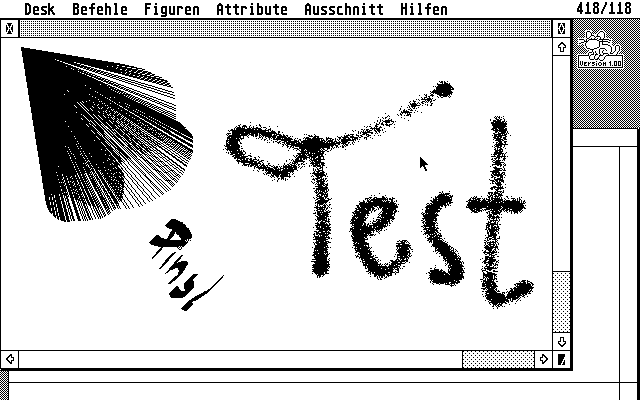

# TH-Paint

This is a painting progam I wrote for my Atari-ST in MC-68000 assembly in
1987-1988.

In first order the program is a showcase for all the graphics operations the
ATARI GEM's "GDI" offered (e.g drawing lines, circles and text in various
variations), in particular while exhausting all the possible variations (e.g.
the XOR painting mode).  For me it was also a great learning experience in
designing Graphical User Interfaces (based on the "AES"), which was a new thing
back in 1986. Looking at this again today I notice the principles for managing
windows and low-level (2D) graphics haven't changed much, if at all, in the
past 30 years.

Maybe more interesting are the various operations on selections, such as
mirroring, rotation and projection, which I wrote myself without using GDI or
BitBlt hardware. In particular the raster copy function used for dragging a
selected area of the image with the mouse (i.e. not just a rubberband) is
heavily optimized for performance (basically performing in-place rotation /
move of data, see function "copy_blk" in [module "fa.asm"](src/fa.asm).

Following is just a random screenshot showing the menu and a few simple
drawings.

## Notes

In case you wonder "Why in Assembly and not in C?": The short answer is I
simply didn't have a C compiler yet, but coming from an 8-bit system (see my
[VIC-20 games repository](https://github.com/tomzox/vic20_games)) I
knew assembly well and was interested in learning it for a 32-bit CPU. Also,
as noted above, some of the more complex operations on large bitmaps required
assembly anyway to get acceptable performance (after all the CPU still was
clocked only at 8 MHz).

The assembly code was written for the "GST 68000 Macro Assembler
A246V040". I still found a mention in a
[review of ST assemblers](https://www.atarimagazines.com/startv1n1/STAssemblers.html)
but otherwise the company seems to have disappeared and no documentation is to
be found anywhere on the Internet. Fortunately the assembly syntax seems to be
the official Motorola syntax and thus supported by many other assemblers (e.g.
[vasm](http://sun.hasenbraten.de/vasm/) parses it just fine).  However the
macros used for system calls are not portable. I'll try to find a solution to
allow building the software using a free assembler.

The binary file "src/fa.rcs" is created using the DRI Resource Editor,
containing definition of the menu and dialog boxes.  The software for
maintaining the file is closed, but the format is open, as it's read directly
by the AES function
[rsrc_load](https://freemint.github.io/tos.hyp/en/rsrc.html#rsrc_load) during
start of the program. This means the file is not part of the build, but must be
present in the directory of the executable.
